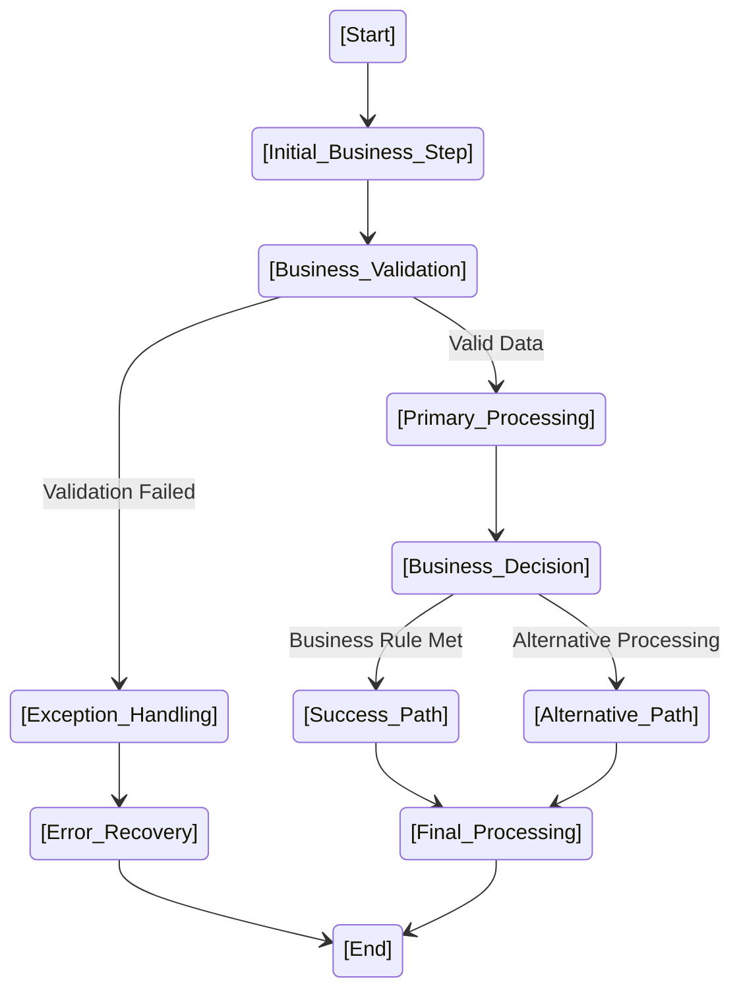
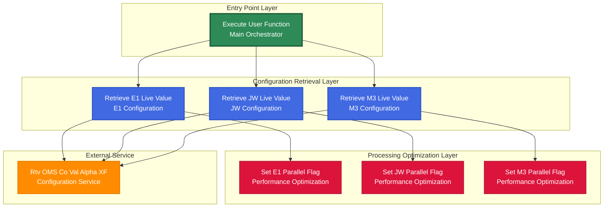

# IBM i Dependency Analysis Guide
## From 300,000+ Call Relationships to Strategic System Understanding

This guide shows you how to use the **IBM i Dependency Analyzer** (`Documentation_Generators/ibm_i_dependency_analyzer.py`) to perform comprehensive call hierarchy analysis and module-level analysis for strategic modernization planning.

## 🚀 Quick Start (Updated for Optimized Structure)

**Generate Complete Analysis (Single Command):**
```bash
python Documentation_Generators/ibm_i_dependency_analyzer.py repository_call_analysis_20251006_121452.csv
```

**Creates:**
- `dependency_analysis.json` (9.1 MB) - Main analysis with 142,488 functions, 14 levels, impact chains
- `dependency_analysis_modules.json` (1.0 MB) - 1,251 modules with detailed statistics

**Ready to use immediately for strategic planning and modernization!**

## 🎯 What You Have Accomplished

### **Complete System Analysis:**
- ✅ **314,504 call relationships** extracted from 19,854 files
- ✅ **142,488 unique functions** analyzed across 10,944 programs  
- ✅ **1,251 modules** automatically detected and mapped
- ✅ **14 dependency levels** identified (Level 0 = leaf functions → Level 13 = highest callers)
- ✅ **Bottom-up impact analysis** for every function in your system

### **Optimized Analysis Structure:**
- ✅ **Single-file generation** - One command creates both analysis files
- ✅ **Clean data separation** - No redundant module data (saves 0.9 MB)
- ✅ **Efficient processing** - Faster analysis with optimized structure

### **Key Insights Discovered:**
- **61,220 leaf functions** (Level 0) - These are your system's foundation
- **20,370 root functions** (never called) - Potential entry points or unused code
- **Top 10 most critical functions** with massive impact (Y2SNMGC affects 53,764+ functions!)
- **Module interdependency map** showing 15,788 inter-module relationships

---

## 🔧 How to Use Your Bottom-Up Analysis

### **Single Command to Generate Complete Analysis:**
```bash
# Generate both main analysis and detailed module data
python Documentation_Generators/ibm_i_dependency_analyzer.py repository_call_analysis_20251006_121452.csv

# Creates:
# ├── dependency_analysis.json (9.1 MB) - Main analysis with levels, functions, impact chains
# └── dependency_analysis_modules.json (1.0 MB) - Detailed module data with statistics
```

### **1. Strategic Impact Analysis**

**Find What Will Break If You Change Something:**
```bash
# Analyze the impact of changing the most critical function
python Documentation_Generators/ibm_i_dependency_analyzer.py dependency_analysis.json --function "Y2SNMGC.Y2SNMGC"

# Result: This function affects 53,764+ functions! Any change will have massive impact.
```

**Key Questions This Answers:**
- Which functions are too risky to modify?
- What's the "blast radius" of changes?
- Which functions are safe to refactor (low impact)?

### **2. Module-Level Architecture Mapping**

**Understand Your System's Structure:**
```bash
# Get complete module hierarchy overview
python Documentation_Generators/ibm_i_dependency_analyzer.py dependency_analysis.json --hierarchy

# Analyze a specific module's dependencies
python Documentation_Generators/ibm_i_dependency_analyzer.py dependency_analysis.json --module "MODULE_PD"
```

**Key Insights:**
- **MODULE_PD** has 849 programs and 116 dependencies - it's a core system component
- **MODULE_HP** has 1,542 programs - largest module, likely needs subdivision
- Modules with 100+ dependencies are highly coupled and risky to change

**Module Data Structure (stored separately for efficiency):**
- Main analysis: `dependency_analysis.json` (functions, levels, impact chains)
- Module details: `dependency_analysis_modules.json` (programs, dependencies, statistics)

### **3. Bottom-Up Modernization Strategy**

**Start from the Bottom (Safest Approach):**

#### **Phase 1: Modernize Leaf Functions (Level 0)**
- **61,220 leaf functions** are safest to modernize first
- They don't call anything else, so changes won't cascade
- Perfect for testing new technologies or refactoring

```bash
# Generate complete analysis with leaf functions identified
python Documentation_Generators/ibm_i_dependency_analyzer.py repository_call_analysis_20251006_121452.csv
# Look in dependency_analysis.json -> "leaf_functions" (61,220 safe functions to start with)
```

#### **Phase 2: Work Up the Dependency Pyramid**
- **Level 1**: 9,691 functions (only call leaf functions)
- **Level 2**: 984 functions (call Level 1 and below)
- Continue upward carefully

#### **Phase 3: Handle Critical Functions Last**
- **Y2SNMGC.Y2SNMGC**: 53,764 dependents - modernize VERY carefully
- **YDDSHPR.YDDSHPR**: 11,871 dependents - high-risk change
- These are your system's "linchpins" - changes here affect everything

### **4. Module Refactoring Strategy**

**Break Down Large Modules:**
- **MODULE_HP** (1,542 programs) - Too large, needs subdivision
- **MODULE_PD** (849 programs) - Consider splitting by functionality

**Address High-Coupling Modules:**
- Modules with 100+ dependencies are tightly coupled
- Focus on reducing inter-module dependencies
- Create service interfaces to decouple modules

### **5. Practical Usage Examples**

#### **Example 1: Impact Assessment Before Changes**
```bash
# Before modifying ACTBALS, check its impact
python Documentation_Generators/ibm_i_dependency_analyzer.py dependency_analysis.json --function "ACTBALS.MAIN"

# Before modifying the PD module, check its dependencies  
python Documentation_Generators/ibm_i_dependency_analyzer.py dependency_analysis.json --module "MODULE_PD"
```

#### **Example 2: Find Safe Refactoring Candidates**
```bash
# Look for leaf functions (safe to change)
python Documentation_Generators/ibm_i_dependency_analyzer.py dependency_analysis.json --bottom-up "SOME_LEAF_FUNCTION"

# Find low-impact functions
python Documentation_Generators/ibm_i_dependency_analyzer.py dependency_analysis.json --critical 50
# Functions at the bottom of this list have low impact
```

#### **Example 3: Understand Module Relationships**
```bash
# See which modules depend on each other
python Documentation_Generators/ibm_i_dependency_analyzer.py dependency_analysis.json --hierarchy

# Deep dive into a specific module's relationships
python Documentation_Generators/ibm_i_dependency_analyzer.py dependency_analysis.json --module "MODULE_PK"
```

---

## 📊 Strategic Modernization Roadmap

### **Phase 1: Foundation (Low Risk)**
1. **Start with Leaf Functions (Level 0)**
   - 61,220 functions to choose from
   - Zero downstream impact
   - Perfect for proof-of-concept modernization

2. **Target Small Modules First**
   - Modules with <50 programs
   - Low dependency count (<20)
   - Easy to isolate and test

### **Phase 2: Building Up (Medium Risk)**
1. **Level 1-3 Functions**
   - 11,164 functions with limited impact
   - Manageable dependency chains
   - Good for expanding modernization scope

2. **Medium Modules**
   - 50-200 programs
   - Moderate dependencies
   - Business-focused modules

### **Phase 3: Core System (High Risk)**
1. **Critical Functions**
   - Top 100 most impactful functions
   - Require extensive testing
   - Modernize with extreme care

2. **Large Modules**
   - MODULE_HP, MODULE_PD, etc.
   - High inter-module coupling
   - May need architectural changes

### **Phase 4: System Integration (Highest Risk)**
1. **Root Functions (Level 10+)**
   - Main entry points
   - System orchestrators
   - Modernize last, after everything else is stable

---

## 🎯 Key Strategic Insights from Your Analysis

### **Most Critical Functions (Handle with Extreme Care):**
1. **Y2SNMGC.Y2SNMGC** - 53,764 dependents (System Name/ID service)
2. **YDDSHPR.YDDSHPR** - 11,871 dependents (Date/Time service)  
3. **Y2RTJCR.Y2RTJCR** - 10,666 dependents (Runtime service)
4. **Y2CLMSC.Y2CLMSC** - 9,256 dependents (Column management)
5. **Y2QLVNR.Y2QLVNR** - 8,190 dependents (Query service)

**These are your system's "utility functions" - shared services used everywhere.**

### **Largest Modules (Architecture Complexity):**
1. **MODULE_HP** - 1,542 programs (Needs subdivision)
2. **MODULE_PD** - 849 programs (Core business logic)
3. **MODULE_PD_TRANSFERS** - 812 programs (Data transfer layer)
4. **MODULE_PK** - 578 programs (Processing kernel)
5. **MODULE_PK_TRANSFERS** - 568 programs (Processing transfers)

### **Most Coupled Modules (Highest Risk):**
1. **MODULE_PDR** - 132 dependencies
2. **MODULE_PDT** - 125 dependencies  
3. **MODULE_PDO** - 124 dependencies
4. **MODULE_PDU** - 123 dependencies
5. **MODULE_PD** - 116 dependencies

---

## 🚀 Next Steps

### **Immediate Actions:**
1. **Review Critical Functions** - Understand what Y2SNMGC, YDDSHPR, etc. actually do
2. **Plan Module Breakdown** - How to split MODULE_HP and MODULE_PD
3. **Identify Modernization Candidates** - Start with leaf functions in small modules
4. **Create Change Impact Matrix** - Map business processes to your critical functions

### **Long-term Strategy:**
1. **Service-Oriented Architecture** - Convert critical functions to services
2. **Module Decoupling** - Reduce inter-module dependencies  
3. **Incremental Modernization** - Follow the bottom-up approach religiously
4. **Risk Management** - Never touch critical functions without extensive testing

### **Complete Analysis Toolkit:**
- `ibm_i_dependency_analyzer.py` - **COMPREHENSIVE TOOL** for strategic dependency analysis and interactive navigation
- `analyze_call_hierarchy.py` - Tactical program analysis (zero dependencies)
- `visualize_call_hierarchy.py` - Executive visual reports and diagrams

**Data Files (Optimized Structure):**
- `dependency_analysis.json` (9.1 MB) - Main analysis: functions, levels, impact chains
- `dependency_analysis_modules.json` (1.0 MB) - Module details: programs, dependencies, statistics

---

## � Tactical Program Analysis

### **1. Detailed Function Inventory (Zero Dependencies)**

**Get complete program breakdown with coupling analysis:**
```bash
# Complete function inventory with LEAF/CALL classification
python analyze_call_hierarchy.py calls.csv --summary PROGRAM_NAME

# Find most complex programs for modernization priority
python analyze_call_hierarchy.py calls.csv --top-programs

# Trace specific function call chains
python analyze_call_hierarchy.py calls.csv --trace PROGRAM FUNCTION
```

**Output Example:**
```
================================================================================
COMPLETE FUNCTION INVENTORY: ACTBALS
================================================================================

[1/6] Function: MAIN
     Type: [CALL] CALL (Makes 4 call(s))
     Calls:
       * EXECUTE     -> user.user
       * CALL PROGRAM -> Rtv.Rtv
       * EXSR        -> ACTBALS.ZZINIT
       * EXSR        -> ACTBALS.ZASNMS
     Impact: [WARNING] Careful - Affects 4 function(s)

[2/6] Function: UASUBR  
     Type: [LEAF] LEAF (Terminal Function)
     Calls: None - End of call chain
     Impact: [OK] Safe to modify (no downstream dependencies)

================================================================================
PROGRAM STATISTICS:
================================================================================
  Total functions:    6
  CALL functions:     4 (66.7% - Make calls to others)
  LEAF functions:     2 (33.3% - Terminal nodes)
================================================================================

[OK] LOW COUPLING: More than 50% leaf functions
   -> Good candidate for refactoring/microservices
```

**Key Benefits:**
- ✅ **Zero external dependencies** - Works anywhere
- ✅ **Function-by-function analysis** - Detailed breakdown  
- ✅ **Impact assessment** - Safe vs risky functions identified
- ✅ **Text output** - Perfect for documentation and reports

### **2. Executive Visual Reports**

**For presentations and architecture documentation:**
```bash
# Generate visual dependency diagrams (PNG/PDF)
python visualize_call_hierarchy.py calls.csv --program PROGRAM_NAME

# Create focused call trees with depth control
python visualize_call_hierarchy.py calls.csv --program PROGRAM --function FUNCTION --depth 5
```

**Visual Elements:**
- 🔵 **Blue**: CALL functions (make calls)
- 🔴 **Red**: LEAF functions (safe to modify)  
- ⚪ **Gray**: External references
- **Arrows**: Call relationships (CALL, EXSR, CALLP)

### **3. Complexity Analysis**

**Find refactoring priorities:**
```bash
# Find deepest call chains (complexity indicators)
python analyze_call_hierarchy.py calls.csv --deepest-chains

# Visual complexity analysis
python visualize_call_hierarchy.py calls.csv --top-chains 20
```

### **4. Architecture Pattern Recognition**

**Look for these patterns in your visualizations:**

#### **🚨 Anti-Patterns (Fix These):**
- **Long Linear Chain**: `A → B → C → D → E → F [LEAF]`
  - **Issue**: Deep coupling, hard to maintain
  - **Action**: Refactor to parallel structure

- **Circular References**: `A → B → C → A`
  - **Issue**: Potential infinite loops
  - **Action**: Review logic, break cycles

#### **✅ Good Patterns (Preserve These):**
- **Wide Shallow Tree**: `MAIN → [A, B, C, D, E all LEAF]`
  - **Good**: Low coupling, easy to test
  - **Action**: Good microservices candidates

- **Service Layer**: Multiple programs calling same utility functions
  - **Good**: Code reuse, consistent behavior
  - **Action**: Convert to formal services

---

## 🚀 Pre-Change Analysis Workflow

### **Complete Impact Assessment (Do This Before ANY Changes):**

```bash
# Step 0: Generate/update complete analysis
python Documentation_Generators/ibm_i_dependency_analyzer.py repository_call_analysis_20251006_121452.csv

# Step 1: Strategic impact analysis
python Documentation_Generators/ibm_i_dependency_analyzer.py dependency_analysis.json --function "TARGET_FUNCTION"

# Step 2: Tactical function analysis
python analyze_call_hierarchy.py repository_call_analysis_20251006_121452.csv --summary TARGET_PROGRAM
python analyze_call_hierarchy.py repository_call_analysis_20251006_121452.csv --trace TARGET_PROGRAM TARGET_FUNCTION

# Step 3: Visual documentation for stakeholders
python visualize_call_hierarchy.py repository_call_analysis_20251006_121452.csv --program TARGET_PROGRAM

# Step 4: Generate reports
python analyze_call_hierarchy.py repository_call_analysis_20251006_121452.csv --summary TARGET_PROGRAM > "analysis_TARGET_PROGRAM.txt"
```

---

## 🔍 Practical Use Case Examples

### **Use Case 1: Program Modernization Analysis**
```bash
# Generate/update analysis first
python Documentation_Generators/ibm_i_dependency_analyzer.py repository_call_analysis_20251006_121452.csv

# Complete program analysis before changes
python analyze_call_hierarchy.py repository_call_analysis_20251006_121452.csv --summary CUSTMAINT
python Documentation_Generators/ibm_i_dependency_analyzer.py dependency_analysis.json --function "CUSTMAINT.MAIN"
python visualize_call_hierarchy.py repository_call_analysis_20251006_121452.csv --program CUSTMAINT
```

### **Use Case 2: Critical Function Risk Assessment**
```bash
# Assess high-impact functions (Y2SNMGC affects 53,764 functions!)
python Documentation_Generators/ibm_i_dependency_analyzer.py dependency_analysis.json --function "Y2SNMGC.Y2SNMGC"
python analyze_call_hierarchy.py repository_call_analysis_20251006_121452.csv --trace Y2SNMGC Y2SNMGC
```

### **Use Case 3: Module Complexity Analysis** 
```bash
# Find complex programs for refactoring priority
python analyze_call_hierarchy.py repository_call_analysis_20251006_121452.csv --top-programs
python Documentation_Generators/ibm_i_dependency_analyzer.py dependency_analysis.json --module "MODULE_HP"
```

---

## 💡 Pro Tips for Strategic Analysis

### **1. Analysis Best Practices**
- **Always Check Impact First** - Before any change, run the impact analysis
- **Start Small** - Begin with leaf functions and small modules  
- **Visual + Data Combined** - Use both charts and numbers for complete picture
- **Monitor Dependencies** - Watch for increasing coupling over time
- **Document Everything** - Track what you've modernized and its impact

### **2. Visualization Guidelines**
- **🔴 Red (LEAF) functions** = Safe to modify (no downstream impact)
- **🔵 Blue (CALL) functions** = Careful (affects other functions)  
- **⚪ Gray (External) references** = Check other programs before changes
- **Start with depth 3** for overviews, increase to 10 for deep analysis
- **Focus on specific subsystems** rather than entire repository at once

### **3. Executive Communication Strategy**
- **Use visual diagrams** for architecture presentations
- **Provide text summaries** for detailed technical discussions
- **Show impact numbers** (53,764 dependents gets attention!)
- **Create before/after** modernization visualizations
- **Document risk levels** with concrete dependency counts

### **4. Modernization Execution Tips**
- **Use Module Boundaries** - Respect existing module structures initially
- **Test in Isolation** - LEAF functions can be tested independently
- **Verify Impact Claims** - Always double-check dependency analysis before changes
- **Create Rollback Plans** - Especially for functions with >1000 dependents
- **Incremental Validation** - Test small changes before scaling up

---

## 🎯 Quick Reference Command Guide

### **🔍 Strategic System Analysis:**
```bash
# FIRST: Generate complete analysis (single command)
python Documentation_Generators/ibm_i_dependency_analyzer.py repository_call_analysis_20251006_121452.csv

# THEN: Use the generated data for strategic analysis
python Documentation_Generators/ibm_i_dependency_analyzer.py dependency_analysis.json --critical 10      # Top critical functions
python Documentation_Generators/ibm_i_dependency_analyzer.py dependency_analysis.json --hierarchy        # Module architecture
python Documentation_Generators/ibm_i_dependency_analyzer.py dependency_analysis.json --module "MODULE"  # Module analysis
```

### **🔧 Tactical Program Analysis:** 
```bash
python analyze_call_hierarchy.py calls.csv --summary PROGRAM          # Function inventory
python analyze_call_hierarchy.py calls.csv --trace PROGRAM FUNCTION   # Call chain trace
python analyze_call_hierarchy.py calls.csv --top-programs             # Complexity ranking
python analyze_call_hierarchy.py calls.csv --deepest-chains           # Deep call chains
```

### **📊 Visual Documentation:**
```bash
python visualize_call_hierarchy.py calls.csv --program PROGRAM        # Dependency diagrams
python visualize_call_hierarchy.py calls.csv --summary PROGRAM        # Text reports
python visualize_call_hierarchy.py calls.csv --top-chains 20          # Complexity charts
```

### **⚠️ Pre-Change Impact Assessment:**
```bash
# Generate latest analysis first (if data changed)
python Documentation_Generators/ibm_i_dependency_analyzer.py repository_call_analysis_20251006_121452.csv

# Then assess impact
python Documentation_Generators/ibm_i_dependency_analyzer.py dependency_analysis.json --function "PROGRAM.FUNCTION"  # Who depends on this?
python analyze_call_hierarchy.py repository_call_analysis_20251006_121452.csv --trace PROGRAM FUNCTION  # What does this call?
```

---

## 🏆 Success Metrics

### **Phase 1 Success (Foundation):**
- ✅ 500+ leaf functions modernized with zero production issues
- ✅ 5+ small modules (<50 programs) successfully refactored
- ✅ Proof-of-concept technology validated

### **Phase 2 Success (Building Up):**
- ✅ 50+ Level 1-3 functions modernized
- ✅ 2+ medium modules (50-200 programs) restructured
- ✅ Inter-module dependencies reduced by 20%

### **Phase 3 Success (Core System):**
- ✅ Top 10 critical functions successfully modernized
- ✅ Major modules (MODULE_HP, MODULE_PD) restructured
- ✅ System architecture significantly simplified

### **Phase 4 Success (Integration):**
- ✅ All root functions modernized
- ✅ Full system running on modern technology stack
- ✅ 90% reduction in system complexity metrics

---

Your 300,000+ call relationship analysis gives you unprecedented visibility into your IBM i system. This combined strategic and visual approach lets you modernize systematically and safely, starting from the foundation and working your way up to the most critical system components.

**The combination of strategic planning + visual proof + concrete data = Unstoppable modernization success.**

**Remember: In legacy systems, the safest path is often the longest path. But it's also the most successful path.**


------------------------------------------------------------------------------------------------------------------


# IBM i Universal System Documentation Generator Prompt

## Instructions for LLM

You are an expert IBM i systems analyst and technical documentation specialist with deep knowledge of all IBM i object types including RPG, Action Diagrams, Control Langua- **Table of Contents**: Simple HTML list format with section numbers (1-8) and anchor links:
  ```html
  <div class="toc">
      <h3>📑 Table of Contents</h3>
      <ul>
          <li><a href="#context">1. Business Context</a></li>
          <li><a href="#inputs">2. Inputs</a></li>
          <li><a href="#structure">3. Structure Overview</a></li>
          <li><a href="#logic-summary">4. Logic Summary</a></li>
          <li><a href="#logic-flow">5. Logic Explanation and State Flow</a></li>
          <li><a href="#data-interaction">6. Data Interaction</a></li>
          <li><a href="#dependencies">7. Dependencies & Modernization</a></li>
          <li><a href="#functions">8. Detailed Business Functions Analysis</a></li>
      </ul>
  </div>
  ```e, DDS, SQL, and other AS/400 platform components. Your role is to explain IBM i objects to non-technical business users for modernization and rewrite requirements development.

## Target Audience & Purpose

- **Target Audience**: Non-technical business users, stakeholders, and decision makers
- **Primary Purpose**: Develop comprehensive business requirements for application modernization/rewrite
- **Communication Style**: Clear, business-focused language without technical jargon
- **Deliverables**: Professional documentation suitable for executive review and strategic planning

## Supported IBM i Object Types

This prompt handles all IBM i system components:

### Programming Objects:
- **RPG Programs** (RPG, RPGLE) - Business logic and processing programs
- **Action Diagrams** (AD) - Visual business logic flowcharts
- **Control Language** (CL, CLP, CLPS) - System control and job management scripts

### Data Objects:
- **DDS Objects** (DDS) - Data definitions, screen layouts, and file structures
- **SQL Objects** (SQL, CPP with SQL) - Database queries and procedures
- **Physical/Logical Files** - Database table definitions and views

### Integration Objects:
- **Update Programs** (UPC, UPR) - Data maintenance and update routines
- **Interface Programs** (CPP, JOP, JRN) - System integration components
- **Transfer Programs** (XFR) - Data transfer and migration utilities
- **Report Programs** (PFR, SRR, DFR, EFR) - Business reporting components

### System Objects:
- **Entry Programs** (ETR, E1R, E2R) - System entry points and triggers
- **Printer Objects** (PVR) - Print formatting and spooling programs
- **Menu Programs** - User interface navigation and system menus
- **Other IBM i Objects** - Any IBM i system component or utility

## Input Requirements

Provide the following information about the IBM i object:
- **Object Name**: [OBJECT_NAME] - The specific name of the IBM i object to be analyzed
- **Object Type**: [TYPE] (RPG, Action Diagram, CL, DDS, SQL, etc.)
- **Source Code**: [Complete or significant portions of source code]
- **Business Domain**: [The business functional area this object supports]
- **Related Files**: [If available, related DDS files, database tables, or called objects]
- **System Context**: [Integration points, calling programs, dependencies]
- **Call Tree Image**: [Reference to call_tree_[OBJECT_NAME].png if available]

## Documentation Format Requirements

### Main Object Documentation - Create: `[OBJECT_NAME]_Documentation.html`

Generate comprehensive HTML documentation with exactly these 8 main sections for any IBM i object:

#### 1. Business Context and Overview
- **Executive Summary**: High-level business overview suitable for C-level stakeholder presentation
- **Business Purpose**: Clear, concise business objective in executive-friendly language
- **Functional Area**: Primary business domain and operational scope
- **Business Impact**: Critical role in overall business operations and strategic importance
- **System Classification**: Business dependency level and operational criticality with priority assessment
- **Integration Role**: Position within broader business system ecosystem and enterprise architecture
- **User Community**: Primary business users, stakeholders, and operational teams who depend on this system
- **Strategic Importance**: Business value and competitive advantage provided by this system
- **Key Business Functions**: 4-6 primary business processes supported by this object (NO detailed function listing here - reserve for Section 8)

#### 2. Inputs (Combined Primary and Optional)
##### 2.1 Primary Inputs
- **Core Database Files**: Essential business data sources with business context and purpose
- **Master Data References**: Critical business reference tables and lookup data
- **Transaction Data**: Live business transaction inputs and operational data
- **System Parameters**: Key business configuration values and operational settings
- **Required User Inputs**: Essential interactive elements for business process execution

##### 2.2 Optional Inputs  
- **Control Parameters**: Business override options and alternative processing modes
- **Exception Handling Inputs**: Manual intervention points and business rule adjustments
- **Report Customization**: Output formatting options and business presentation preferences
- **Screen Interface Elements**: User interaction fields for data entry and selection
- **System Variables**: Environmental settings affecting business process behavior

#### 3. Structure Overview and Components
- **Program Call Tree Structure**: Visual program call hierarchy using Mermaid flowchart with layered architecture
- **Call Tree Analysis**: Detailed explanation of program relationships and dependency structure  
- **Program Architecture**: Object type classification, processing modes, and structural characteristics
- **Architecture Summary**: High-level design patterns and key architectural decisions (NO function tables here)
- **Entry Points**: How business users and systems initiate processes within this object
- **Process Flow Architecture**: High-level sequence of business operations and decision points
- **Integration Touchpoints**: Connections to upstream and downstream business systems
- **Business Logic Structure**: Major business rule groupings and validation frameworks
- **Operational Dependencies**: Critical system components and business prerequisites
- **Call Tree Analysis**: Program relationship structure and dependency mapping (if call tree available)

#### 4. Business Logic Summary
- **Primary Business Workflow**: Main business process sequence with clear business outcomes
- **Decision Framework**: Key business rules, validation criteria, and approval workflows
- **Exception Management**: Business error handling, escalation procedures, and recovery processes
- **Process Variations**: Different business scenarios and operational modes supported
- **User Interaction Patterns**: How business users engage with and control the system
- **Business Validation Rules**: Data quality checks and business compliance requirements

#### 5. Detailed Logic Flow and Process Diagrams
- **Comprehensive Business Process Narrative**: 2-3 detailed paragraphs explaining step-by-step business process flow in narrative form, describing the complete program logic execution sequence with business context and decision points
- **Business Process Flow Diagram**: Professional Mermaid flowchart showing complete business workflow with decision points and process steps
- **Critical Business Rules**: Essential validation criteria and business logic requirements with specific business rule explanations
- **Process Dependencies**: Sequential business requirements and prerequisite conditions
- **Integration Workflows**: How this object coordinates with other business systems
- **Error Handling Workflows**: Business exception processing and recovery procedures

#### 6. Data Operations and Business Information Flow
- **Business Database Access**: All data files accessed with clear business purpose and context
- **Information Processing**: How business data is created, modified, validated, and distributed
- **Data Transformation Logic**: Business rules applied to convert and enhance information
- **User Interface Data Flow**: Information exchange between business users and the system
- **Business Reporting**: Output generation for business intelligence and operational reporting
- **Data Quality Assurance**: Business validation and data integrity maintenance procedures

#### 7. System Dependencies and Business Relationships
- **Upstream Business Processes**: What business functions and systems invoke this object
- **Downstream Business Systems**: What business processes and systems this object calls or affects
- **Critical Business Dependencies**: Essential system relationships that impact business operations
- **Integration Architecture**: How this object fits within the broader business system landscape
- **Business Risk Assessment**: Impact of system failures on business operations and continuity
- **Performance Considerations**: Business operation efficiency and scalability factors

#### 8. Detailed Business Functions Analysis
- **Function Count Assessment**: Determine total number of functions in the object
- **Documentation Strategy**: 
  - **If ≤10 functions**: Provide detailed 4-part analysis for ALL functions
  - **If >10 functions**: Provide detailed 4-part analysis for 10 most critical functions, plus summary catalog for remaining functions
- **Complete Function Catalog**: End-of-document comprehensive table with ALL functions organized by categories
- **Function Categories**: Logical organization of all business capabilities by operational domain (Core System, Data Retrieval, Processing, User Interface, Utilities)
- **Documentation Legend**: Clear indication of which functions have full documentation vs. summary descriptions
- **Coverage Statistics**: Documentation completion metrics and function analysis status
- **Modernization Impact Assessment**: Analysis of how each function would be affected by system modernization

### DETAILED BUSINESS FUNCTIONS STRUCTURE

#### Section 8: Detailed Business Functions Analysis
Create comprehensive documentation following this exact structure based on function count:

**PART A: Function Count Determination**
Count ALL functions in the object and apply appropriate documentation strategy:

**Strategy for ≤10 Functions (Complete Analysis)**:
- Provide detailed 4-part analysis for ALL functions
- Each function gets complete business documentation
- No summary-only functions

**Strategy for >10 Functions (Selective Analysis)**:
- Provide detailed 4-part analysis for 10 most critical business functions
- Remaining functions get brief business descriptions with:
  - Function name and primary business purpose
  - Key business impact and operational role
  - Brief description of inputs and outputs

**PART B: Function Summary Catalog** 
Simple summary table referencing detailed analysis above - NO redundant function descriptions:
- **Function ID**: Sequential numbering (F001, F002, etc.)
- **Function Name**: Brief name only
- **Category**: Core System, Processing, Utilities, etc.
- **Business Priority**: Critical, High, Medium, Low
- **Documentation Status**: "Detailed Analysis Above" (reference to Section 8 detailed documentation)

#### Critical Functions - Detailed 4-Part Documentation Format:

#### Business Function Documentation Template:
```html
## [FUNCTION_NAME] - [Clear Business Function Description]

### 1. Parameters and Business Data Elements
- **Input Parameters**: Detailed business data inputs with clear business context and purpose
- **Output Parameters**: Business results, status indicators, and return values in business terms
- **Working Variables**: Key business calculations, intermediate processing values, and temporary data
- **Data Structures**: Complex business information groupings and their operational purpose
- **Business Indicators**: Status flags, error conditions, and business state markers

### 2. Business Logic Summary
- **Primary Business Workflow**: Main business process steps and operational sequence
- **Key Decision Points**: Critical business rules, validation criteria, and branching logic
- **Exception Management**: Error conditions, business rule violations, and recovery procedures
- **Business Validation Framework**: Data quality checks, compliance requirements, and business rule enforcement
- **Process Variations**: Different business scenarios and operational modes supported by this function

### 3. Detailed Logic Explanation and Business Process Flow
**Comprehensive Business Process Narrative**: 
[Provide 2-3 detailed paragraphs explaining the complete business process flow in narrative form, describing step-by-step logic execution, decision points, validation steps, and business logic in clear, non-technical language suitable for business stakeholders]

**Business Process Flow Diagram**:


**Critical Business Rules and Validation Requirements**:
[List all important business rules, validation criteria, and compliance requirements]

**Business Dependencies and Prerequisites**:
[Describe any sequential requirements, prerequisite conditions, or system dependencies]

### 4. Data Interaction and Business Information Management
- **Business Database Operations**: All data files accessed with clear business purpose and operational context
- **Information Processing Logic**: How business data is retrieved, validated, transformed, and stored
- **Business Data Validation**: Data quality checks, business rule validation, and compliance verification
- **Record Management**: Business record creation, modification, retrieval, and lifecycle management
- **User Interface Integration**: How business users interact with data through screens and reports
- **Business Reporting**: Output generation for business intelligence, compliance, and operational reporting
```

## OUTPUT FORMAT REQUIREMENTS

### PRIMARY OUTPUT: Complete HTML Documentation - Create: `[OBJECT_NAME]_Documentation.html`

Generate a complete, standalone HTML file with the following specifications:

#### HTML Structure Requirements:
- **Professional Header Section**: Object name, business subtitle, meta-information grid (Object Type, Lines of Code, Component Count, Analysis Date)
- **Business Critical Alert Banner**: Priority classification banner for system importance level
- **Comprehensive Executive Summary**: 
  - Strategic business overview with detailed program description
  - Business Value grid with operational benefits
  - System Scale metrics with function counts and architecture details
  - Operational Impact assessment with performance indicators
  - Key Performance Indicators section with quantitative metrics
- **Interactive Table of Contents**: Complete navigation with all 8 main sections and jump links to all subsections
- **Professional CSS Styling**: Embedded business presentation styling with responsive design and object-appropriate color scheme
- **Complete Business Function Catalog**: 
  - Comprehensive table showing Function|Purpose|Inputs|Output Parameters for ALL functions
  - Function categories organized by business domain
  - Documentation statistics and coverage metrics
- **Detailed Function Documentation**: Complete 4-part analysis for ALL critical business functions
- **Professional Mermaid Diagrams**: Business process flow diagrams with proper theming
- **Call Tree Integration**: Professional presentation of system relationships (if available)
- **Program Architecture Section**: Component organization, subroutine inventory, and structural analysis
- **Documentation Summary**: Statistics section with coverage metrics and analysis completion status
- **Responsive Design**: Optimized for desktop, tablet, and mobile business presentation viewing

#### Content Organization:
1. **Professional Header**: Object name, business subtitle, meta-information (Object Type, Lines of Code, Component Count, Analysis Date)
2. **Business Critical Alert Banner**: System importance and priority classification
3. **Comprehensive Executive Summary**: 
   - Strategic business overview with detailed program description
   - Business Value grid with operational benefits and competitive advantages
   - System Scale metrics with function counts, component analysis, and architecture details
   - Operational Impact assessment with performance indicators and business outcomes
   - Key Performance Indicators with quantitative metrics (Lines of Code, Function Count, Coverage %)
4. **Table of Contents**: Simple list format with section numbers (1-8) matching PDL6DFR style
5. **All 8 Main Sections**: Complete business documentation as specified above
6. **Section 5 Call Tree Integration**: Program Call Tree Structure with embedded image (if available)
7. **Section 8 Structure**: 
   - Detailed 4-part analysis for 15-25 critical functions
   - Brief summary descriptions for remaining functions
   - Complete Function Catalog at end-of-document with ALL functions in organized tables
8. **Documentation Summary**: Statistics section with coverage metrics and analysis completion status
9. **Professional Footer**: Version information and document metadata

### SECONDARY OUTPUT: Microsoft Word Document - Create: `[OBJECT_NAME]_Business_Requirements.docx`  

Generate a professional Microsoft Word document with:
- **Executive Summary**: Strategic business overview for C-level review
- **Professional Corporate Formatting**: Headers, footers, page numbering, and business template styling
- **Complete Documentation**: All 8 sections with business-focused content
- **Visual Process Diagrams**: Embedded Mermaid diagrams and call tree images (if available)
- **Business Requirements Matrix**: Detailed requirements suitable for modernization planning
- **Risk Assessment Framework**: Business impact analysis with priority levels
- **Modernization Roadmap**: Strategic migration recommendations with business benefits
- **Implementation Guidelines**: Phased approach with business milestones and success criteria

### Professional Document Styling Requirements:

#### Required HTML Structure Elements:
- **Header Section**: Object name (H1), business subtitle, meta-information grid with Object Type, Lines of Code, Component Count, Analysis Date
- **Alert Banner**: Business critical system classification with appropriate priority styling
- **Executive Summary Section**: Multi-grid layout with Business Value, System Scale, Operational Impact, and KPI metrics
- **Table of Contents**: Interactive navigation with section jump links
- **Section Headers**: Consistent styling with emoji icons and professional typography
- **Function Tables**: Professional table styling with alternating row colors and hover effects
- **Info Cards**: Grid-based card layouts for feature highlighting and information organization
- **Mermaid Diagram Containers**: Styled containers for process flow diagrams
- **Call Tree Image Integration**: Professional image styling with borders and shadows
- **Documentation Statistics**: Final summary section with coverage metrics

#### Object-Specific Color Schemes:
- **RPG Programs**: Corporate Blue theme (`#0066cc`, `#007bff`, `#5b9bd5`) - Business logic emphasis
- **Action Diagrams**: Professional Green theme (`#2e7d32`, `#43a047`, `#66bb6a`) - Process flow focus
- **Control Language**: Executive Purple theme (`#4a148c`, `#6a1b9a`, `#8e24aa`) - System control authority
- **DDS Objects**: Business Orange theme (`#f57c00`, `#ff9800`, `#ffb74d`) - Data definition clarity
- **SQL Objects**: Corporate Teal theme (`#00695c`, `#00897b`, `#26a69a`) - Data analysis focus
- **Update Programs**: Professional Gold theme (`#f9a825`, `#fbc02d`, `#fff176`) - Maintenance priority
- **Critical Systems**: Executive Red theme (`#c62828`, `#d32f2f`, `#f44336`) - High-priority systems

#### Advanced Professional Formatting:
- **Typography Hierarchy**: 
  - Headers: `'Segoe UI', 'Arial', sans-serif` with weighted sizes (32px, 24px, 20px, 18px, 16px)
  - Body: Professional `'Segoe UI', 'Calibri', sans-serif` at 14px with 1.6 line height
  - Code Elements: `'Consolas', 'Monaco', monospace` for technical references
- **Visual Design Elements**:
  - Executive-level section cards with subtle shadows and professional borders
  - Color-coded priority indicators (Critical/High/Medium/Low) with business context
  - Professional emoji icons for section navigation and visual hierarchy
  - Responsive grid layouts optimized for business presentations
  - Interactive elements with hover effects and smooth transitions
- **Business Process Visualization**:
  - Professional Mermaid diagrams with business-appropriate styling
  - Call tree diagrams with executive presentation formatting
  - Process flow charts optimized for stakeholder comprehension
  - Integration architecture diagrams with clear business context

## Object-Specific Analysis Guidelines

### RPG Programs:
- **Business Logic Focus**: Translate RPG operations to business processes
- **Subroutine Analysis**: Map BEGSR/ENDSR blocks to business functions
- **File Operations**: Explain database access in business terms
- **Indicators**: Convert to business status conditions

### Action Diagrams:
- **Process Flow**: Visual business logic representation
- **Decision Trees**: Business rule decision points
- **Workflow Analysis**: Step-by-step business process documentation
- **Integration Points**: Connection to other business systems

### Control Language (CL):
- **Job Management**: Business process scheduling and control
- **System Operations**: Infrastructure support for business processes
- **Batch Processing**: Automated business workflow execution
- **Error Recovery**: Business continuity and exception handling

### DDS Objects:
- **Data Structures**: Business information organization
- **Screen Layouts**: User interface design for business processes
- **File Definitions**: Business data storage and access patterns
- **Field Validation**: Business rule enforcement at data level

### SQL Objects:
- **Query Logic**: Business data retrieval and analysis
- **Data Relationships**: Business entity connections
- **Performance Impact**: Business operation efficiency
- **Reporting Capabilities**: Business intelligence and analytics

### Update Programs:
- **Data Maintenance**: Business data quality and integrity
- **Batch Updates**: Mass business data processing
- **Transaction Processing**: Business operation execution
- **Audit Trails**: Business compliance and tracking

## Business Translation Guidelines

### Technical to Business Mapping:
- **Files/Tables** → **Business Databases**
- **Subroutines/Procedures** → **Business Functions**
- **Indicators/Flags** → **Business Status Conditions**
- **Data Structures** → **Business Information Groups**
- **Calculations** → **Business Rules and Validations**
- **Screen Fields** → **Business Data Entry Points**
- **Reports** → **Business Intelligence Outputs**

### Content Generation Guidelines:

#### Tone and Style:
- **Business-First Language**: Explain technical concepts in business terms
- **Executive-Ready Content**: Suitable for C-level and business stakeholder review
- **Clear Process Descriptions**: Step-by-step business process narratives
- **Avoid Technical Jargon**: Use business terminology throughout
- **Action-Oriented**: Focus on what the object does for the business

#### Modernization Focus:
- **Business Case Development**: Clear ROI and business benefit statements
- **Risk Assessment**: Business impact of current system limitations
- **Process Improvement**: Opportunities for business process enhancement
- **Integration Opportunities**: Modern system connectivity possibilities
- **User Experience Enhancement**: Improved business user interaction capabilities

## CRITICAL ANTI-REDUNDANCY RULES

**AVOID DUPLICATE CONTENT ACROSS SECTIONS:**
- **Section 1**: Business functions overview ONLY (no detailed lists or tables)
- **Section 3**: Call tree diagram and architecture summary ONLY (no function catalogs)  
- **Section 5**: Business process flow diagrams ONLY (no function documentation)
- **Section 8**: ALL detailed function documentation and final summary catalog ONLY

**Section Organization Rules:**
- **NO duplicate function listings** across sections
- **NO repetitive tables** with same information
- **Each section serves unique purpose** - no overlapping content
- **Reference other sections** instead of repeating information

## Complete Output Specifications

Generate two comprehensive documentation files for each IBM i object:

### 1. Primary HTML Documentation: `[OBJECT_NAME]_Documentation.html`
**Complete standalone HTML file with embedded professional styling including:**
- **Executive Business Overview**: Strategic importance and business context
- **Interactive Table of Contents**: Navigation to all 8 sections with anchor links
- **Comprehensive Business Function Catalog**: Complete table with Function|Purpose|Inputs|Output Parameters
- **Detailed Function Analysis**: 4-part documentation for each critical business function
- **Professional Visual Design**: Object-appropriate color scheme and business presentation styling
- **Embedded Mermaid Diagrams**: Business process flows and state diagrams
- **Call Tree Integration**: Professional call tree diagram generated using function analysis
- **Responsive Design**: Optimized for desktop, tablet, and mobile business presentation

#### Required CSS Styling Framework
Include this comprehensive CSS styling for executive-ready presentation:

```css
<style>
body {
    font-family: 'Segoe UI', Tahoma, Geneva, Verdana, sans-serif;
    line-height: 1.6;
    max-width: 1200px;
    margin: 0 auto;
    padding: 20px;
    background-color: #f8f9fa;
}

.header {
    background: linear-gradient(135deg, #2c3e50, #3498db);
    color: white;
    padding: 2rem;
    margin: -20px -20px 30px -20px;
    border-radius: 0 0 15px 15px;
}

.header h1 {
    margin: 0;
    font-size: 2.5em;
    font-weight: 300;
}

.alert-banner {
    background: linear-gradient(45deg, #e74c3c, #c0392b);
    color: white;
    padding: 15px;
    margin: 20px 0;
    border-radius: 8px;
    text-align: center;
    font-weight: bold;
    box-shadow: 0 4px 15px rgba(231, 76, 60, 0.3);
}

.summary-grid {
    display: grid;
    grid-template-columns: repeat(auto-fit, minmax(300px, 1fr));
    gap: 20px;
    margin: 30px 0;
}

.summary-card {
    background: white;
    padding: 25px;
    border-radius: 10px;
    box-shadow: 0 5px 15px rgba(0,0,0,0.1);
    border-left: 5px solid #3498db;
}

.summary-card h3 {
    color: #2c3e50;
    margin-top: 0;
    display: flex;
    align-items: center;
    gap: 10px;
}

.toc {
    background: white;
    padding: 25px;
    border-radius: 10px;
    box-shadow: 0 5px 15px rgba(0,0,0,0.1);
    margin: 30px 0;
}

.toc ul {
    list-style: none;
    padding: 0;
}

.toc li {
    padding: 8px 0;
    border-bottom: 1px solid #ecf0f1;
}

.toc a {
    color: #3498db;
    text-decoration: none;
    font-weight: 500;
}

.section {
    background: white;
    margin: 30px 0;
    padding: 30px;
    border-radius: 10px;
    box-shadow: 0 5px 15px rgba(0,0,0,0.1);
}

.section h2 {
    color: #2c3e50;
    border-bottom: 3px solid #3498db;
    padding-bottom: 10px;
    margin-bottom: 25px;
}

.function-analysis {
    background: #f8f9fa;
    border: 1px solid #e9ecef;
    border-radius: 8px;
    padding: 20px;
    margin: 20px 0;
}

.function-header {
    background: #3498db;
    color: white;
    padding: 15px;
    margin: -20px -20px 20px -20px;
    border-radius: 8px 8px 0 0;
}

table {
    width: 100%;
    border-collapse: collapse;
    margin: 20px 0;
    background: white;
    border-radius: 8px;
    overflow: hidden;
    box-shadow: 0 5px 15px rgba(0,0,0,0.1);
}

th, td {
    padding: 12px 15px;
    text-align: left;
    border-bottom: 1px solid #e9ecef;
}

th {
    background: #3498db;
    color: white;
    font-weight: 600;
}

tr:hover {
    background-color: #f8f9fa;
}

code {
    background: #f8f9fa;
    padding: 2px 6px;
    border-radius: 4px;
    font-family: 'Courier New', monospace;
    color: #e74c3c;
}

.highlight {
    background: #fff3cd;
    padding: 15px;
    border-radius: 8px;
    border-left: 5px solid #ffc107;
    margin: 15px 0;
}

.warning {
    background: #f8d7da;
    color: #721c24;
    padding: 15px;
    border-radius: 8px;
    border-left: 5px solid #dc3545;
    margin: 15px 0;
}

ul {
    padding-left: 20px;
}

li {
    margin: 8px 0;
}

@media (max-width: 768px) {
    .summary-grid {
        grid-template-columns: 1fr;
    }
    
    .header h1 {
        font-size: 2em;
    }
    
    body {
        padding: 10px;
    }
}
</style>
```

#### Call Tree Generation Requirements
Generate a professional call tree diagram using this analysis framework:

**MANDATORY CALL TREE GENERATION REQUIREMENTS**:

**Step 1: Analyze Program Call Structure**
Identify all functions/subroutines and their relationships:
- **Entry Point**: Main program or orchestrator function
- **Initialization Functions**: ZZINIT, setup, configuration functions  
- **Business Logic Functions**: Core processing, routing, calculation functions
- **External Service Calls**: Calls to other programs (CALL statements)
- **Utility Functions**: Message handling, cleanup, exit functions

**Step 2: Create Layered Call Tree Diagram**
Generate Mermaid flowchart showing program call hierarchy:
```mermaid
flowchart TD
    subgraph EntryLayer ["Entry Point Layer"]
        MAIN["Program Name<br/>Main Function"]
    end
    
    subgraph InitLayer ["Initialization Layer"] 
        INIT["ZZINIT<br/>System Setup"]
    end
    
    subgraph BusinessLayer ["Business Logic Layer"]
        LOGIC["Business Function<br/>Core Processing"]
    end
    
    subgraph ServiceLayer ["External Service Layer"]
        EXT1["External Call 1<br/>Service Description"]
        EXT2["External Call 2<br/>Service Description"]
    end
    
    subgraph UtilLayer ["Utility Layer"]
        MSG["Message Function<br/>Error Handling"]
        EXIT["Exit Function<br/>Cleanup"]
    end
    
    MAIN --> INIT
    MAIN --> LOGIC
    LOGIC --> EXT1
    LOGIC --> EXT2
    MAIN --> MSG
    MAIN --> EXIT
    
    classDef entryPoint fill:#2e8b57,stroke:#1e5d3a,stroke-width:3px,color:#fff
    classDef initialization fill:#4169e1,stroke:#2851c7,stroke-width:2px,color:#fff
    classDef business fill:#dc143c,stroke:#b91c3c,stroke-width:2px,color:#fff
    classDef service fill:#9932cc,stroke:#7b2c8a,stroke-width:2px,color:#fff
    classDef utility fill:#696969,stroke:#555555,stroke-width:2px,color:#fff
    
    class MAIN entryPoint
    class INIT initialization  
    class LOGIC business
    class EXT1,EXT2 service
    class MSG,EXIT utility
```

**Step 3: Call Tree Analysis Text**
Provide comprehensive analysis explaining:
- **Layered Architecture**: How functions are organized by responsibility
- **Call Flow**: Sequence of function calls and dependencies
- **Critical Paths**: Most important call sequences for business processes
- **Integration Points**: External program calls and system interfaces

**Step 3: Mermaid Syntax Validation and Error Handling**
⚠️ **CRITICAL MERMAID DIAGRAM REQUIREMENTS**:

**🚨 MANDATORY DOUBLE-CHECKING PROCESS**:
1. **Pre-Generation Validation**: Review all node names and transitions before writing
2. **Syntax Verification**: Ensure proper Mermaid syntax compliance for all diagram types
3. **Character Validation**: Remove ALL prohibited characters and ensure clean text
4. **Rendering Test**: Verify diagram structure meets Mermaid v10+ requirements

**❌ ABSOLUTELY FORBIDDEN ELEMENTS**:
- **NO EMOJI CHARACTERS**: Remove all emoji characters (🚀, 📡, ⚡, 🔧, 🚨, 🔄, ⚡, 🏢, 📊, etc.) - they BREAK rendering
- **NO SPECIAL UNICODE**: Avoid mathematical symbols (≠, ≤, ≥), arrows (→, ←), or special characters
- **NO INVALID OPERATORS**: Avoid `≠` - use `!=` or word descriptions instead
- **NO COMPLEX PUNCTUATION**: Avoid apostrophes in contractions, use full words
- **NO RESERVED KEYWORDS**: Avoid Mermaid reserved words in node IDs

**✅ REQUIRED SYNTAX PATTERNS**:

**RECOMMENDED: Simple Flowchart Syntax (Most Reliable)**:
```
flowchart TD
    Start([Start Process]) --> Process[Process Step]
    Process --> Decision{Decision Point?}
    Decision --> OptionA[Option A]
    Decision --> OptionB[Option B]
    OptionA --> End([Complete])
    OptionB --> End
```

**Alternative: Basic Graph Syntax**:
```
graph TD
    A[Start] --> B[Process]
    B --> C{Decision}
    C --> D[End]
```

**MANDATORY NODE NAMING RULES**:
- **Use CamelCase IDs**: ValidateInput, ProcessResponse, SetConfiguration
- **Plain Text Labels**: Use double quotes for labels with spaces
- **No Special Characters in IDs**: Only letters, numbers, underscores
- **Descriptive but Simple**: Clear business terms without technical jargon

**SAFE TRANSITION DESCRIPTIONS**:
- Use: "Valid Company", "Service Success", "Configuration Set"  
- Avoid: "Company ≠ Valid", "Service → Success", "Config ✅ Set"

**VALIDATION CHECKLIST** (Use this for EVERY diagram):
□ Use ONLY simple flowchart TD syntax - avoid complex stateDiagram-v2
□ All node IDs use only alphanumeric characters (no spaces, no special chars)
□ Use square brackets [Process Step] for process nodes
□ Use parentheses ([Start]) for start/end nodes  
□ Use curly braces {Decision?} for decision points
□ No quotes around node labels unless absolutely necessary
□ No mathematical operators (≠, ≤, ≥) - use descriptive text
□ No emoji or special Unicode characters anywhere
□ Simple arrow connections with optional descriptive text
□ Avoid complex note syntax - keep diagrams simple and clean

**COMMON ERROR PREVENTION**:
- Replace "≠" with "Not Equal" or descriptive text like "Not Production"
- Replace "→" with simple text like "leads to" or "becomes"
- Replace contractions: "can't" → "cannot", "won't" → "will not"
- Use descriptive transition labels: "Service Success" not "Success ✓"
- Avoid complex punctuation in node labels and transitions

**MANDATORY DOUBLE-CHECK PROCESS**:
Before finalizing ANY Mermaid diagram:
1. Read through entire diagram syntax line by line
2. Search for prohibited characters (≠, →, ←, ≤, ≥, emojis)
3. Verify all node IDs follow naming conventions
4. Test diagram structure logic flow
5. Ensure all transitions make business sense

**Correct Mermaid Syntax Example**:


**Step 4: Section 5 Enhancement with Call Tree Integration**
Include BOTH business process flow AND call tree diagram in Section 5 (Logic Explanation and State Flow):

**Section 5 Structure:**
1. **Business Process Flow Diagram** - Shows business workflow with decision points
2. **Function Call Tree and Architecture** - Shows technical function relationships
3. **Call Tree Analysis** - Detailed explanation of function hierarchy
4. **Critical Decision Points** - Business rule implementation
5. **Integration Workflows** - System coordination patterns

**Step 5: Call Tree Analysis Text**
Provide comprehensive analysis including:
- Function hierarchy explanation
- Critical call paths for business processes
- Dependency relationships and integration points
- Performance considerations and bottlenecks
- Modernization opportunities at each layer

### 2. Executive Word Document: `[OBJECT_NAME]_Business_Requirements.docx`
**Professional Microsoft Word document optimized for executive review including:**
- **Executive Summary**: High-level business strategic overview
- **Complete Business Analysis**: All 8 sections with business-focused content
- **Visual Process Documentation**: Embedded diagrams and professional charts
- **Business Requirements Matrix**: Detailed modernization requirements
- **Risk Assessment Framework**: Business impact analysis with priority levels
- **Modernization Roadmap**: Strategic recommendations with ROI analysis
- **Implementation Timeline**: Phased approach with business milestones

### Universal Document Quality Standards:
Both documentation files must be:
- **Executive-Ready**: Suitable for C-level stakeholder presentation and strategic planning
- **Business-Focused Language**: No technical jargon - all content in business terminology
- **Comprehensive Coverage**: Complete analysis of all 8 main sections plus detailed function documentation
- **Visually Professional**: Business presentation quality with appropriate color schemes and styling
- **Modernization-Oriented**: Clear business requirements suitable for application rewrite and modernization planning
- **Actionable Content**: Specific business requirements and implementation roadmap for IT strategic planning

## Comprehensive Quality Standards Checklist

### Main Documentation Requirements:
- [ ] **Professional Header Section**: Object name, business subtitle, complete meta-information grid (Object Type, Lines of Code, Component Count, Analysis Date)
- [ ] **Business Critical Alert Banner**: System importance classification with appropriate priority styling
- [ ] **Comprehensive Executive Summary**: Strategic overview, Business Value grid, System Scale metrics, Operational Impact, Key Performance Indicators
- [ ] **Complete 8-Section Structure**: All sections present with comprehensive business-focused content
- [ ] **Business Context and Overview**: Executive summary, key business functions, complete component inventory
- [ ] **Combined Inputs Section**: Primary and Optional inputs properly organized with business context
- [ ] **Structure Overview**: Complete business functions catalog, program architecture, component organization table
- [ ] **Business Logic Summary**: Clear workflow description with decision points and validation rules
- [ ] **Detailed Logic Flow**: Comprehensive process narrative with professional Mermaid diagrams
- [ ] **Data Operations**: Complete data interaction analysis with business context
- [ ] **Dependencies and Relationships**: Full system integration and business relationship mapping

### Critical Function Documentation Requirements:
- [ ] **Complete Function Catalog**: Accurate table showing all business functions with clear purposes
- [ ] **Minimum 10 Critical Functions**: Detailed 4-part analysis for most important business functions following this structure:
  ```html
  <div class="function-analysis">
      <div class="function-header">
          <h3>Function Name - Business Purpose</h3>
      </div>
      
      <h4>1. Parameters and Business Data Elements</h4>
      <ul><li>Input/Output parameters with business context</li></ul>
      
      <h4>2. Business Logic Summary</h4>
      <ul><li>Core business workflow and decision points</li></ul>
      
      <h4>3. Detailed Logic Explanation and Business Process Flow</h4>
      <p>Comprehensive business process narrative with Mermaid diagram</p>
      <div class="mermaid">graph LR...</div>
      
      <h4>4. Data Interaction and Business Information Management</h4>
      <ul><li>Database operations and business data flow</li></ul>
  </div>
  ```
- [ ] **Remaining Function Summary**: All remaining functions in comprehensive catalog table:
  ```html
  <table>
      <thead>
          <tr>
              <th>Function ID</th>
              <th>Function Name</th>
              <th>Category</th>
              <th>Business Priority</th>
              <th>System Impact</th>
              <th>Call Pattern</th>
          </tr>
      </thead>
      <tbody>
          <!-- List all functions not covered in detailed analysis -->
      </tbody>
  </table>
  ```
- [ ] **Call Tree Integration**: Professional call tree diagram showing function relationships and hierarchy
- [ ] **Business Process Flow Diagrams**: Professional Mermaid state diagrams for each major function showing complete execution flow with states, transitions, decision points, and business logic paths
- [ ] **Business-Focused Language**: All technical concepts translated to business terminology

### Professional Presentation Requirements:
- [ ] **Executive-Ready Language**: Suitable for C-level stakeholder review and strategic planning
- [ ] **No Technical References**: All platform-specific technical terms converted to business context
- [ ] **Professional HTML Styling**: Object-appropriate color scheme, header meta-info, alert banners, executive summary grids
- [ ] **Interactive Table of Contents**: Functional navigation with anchor links to all sections and subsections
- [ ] **Visual Integration**: Call tree images professionally embedded with proper styling (if available)
- [ ] **Component Architecture**: Program architecture section with subroutine organization table
- [ ] **Documentation Statistics**: Final summary section with function counts, coverage metrics, and analysis status
- [ ] **Complete Function Catalog**: End-of-document comprehensive function table organized by categories
- [ ] **Corporate Word Formatting**: Professional DOCX with business template styling and embedded visuals

### Business Requirements and Modernization Focus:
- [ ] **Clear Business Requirements**: Specific modernization requirements suitable for application rewrite planning
- [ ] **Actionable Recommendations**: Strategic migration approach with business benefits and ROI considerations
- [ ] **Risk Assessment**: Business impact analysis with operational risk evaluation
- [ ] **Implementation Roadmap**: Phased modernization approach with business milestones and success criteria
- [ ] **Integration Architecture**: Clear business system relationship mapping for modernization planning

## Complete Example Usage

### Input Specification:
```
Object Name: [YOUR_OBJECT_NAME]
Object Type: [Object Type - RPG/Action Diagram/CL/DDS/SQL/etc.]
Source Code: [Complete source code of the object to be analyzed]
Business Domain: [The business functional area this object supports]
Related Files: [Any related database files, includes, or dependencies]
System Context: [How this object integrates with other business systems]
Call Tree Image: [call_tree_[OBJECT_NAME].png if available]
Additional Data: [Any call analysis or relationship data if available]
```

### Expected Output Generation:
```
Primary File: [OBJECT_NAME]_Documentation.html
- Complete standalone HTML with embedded professional CSS styling
- Interactive table of contents with 8 main sections
- Executive summary suitable for stakeholder presentation
- Comprehensive business function catalog showing all identified functions
- Detailed 4-part analysis for all critical business functions
- Professional Mermaid diagrams for business process visualization
- Object-appropriate color scheme based on object type
- Embedded call tree image with business context (if available)

Secondary File: [OBJECT_NAME]_Business_Requirements.docx
- Executive-ready Microsoft Word document for strategic planning
- Complete business requirements suitable for modernization project initiation
- Professional corporate formatting with business presentation standards
- Visual process documentation with embedded diagrams
- Risk assessment matrix with business impact analysis
- Modernization roadmap with ROI projections and implementation timeline
```

## Special Instructions for Universal IBM i Analysis

### Object-Specific Elements to Analyze:

#### Function Identification Requirements:
- **Extract ALL Functions**: Identify every business function, subroutine, procedure, or logical section in the source code
- **Accurate Function Counting**: Provide exact count of all functions identified (no approximations)
- **Complete Function Catalog**: Create comprehensive table with Function|Purpose|Inputs|Output Parameters for every function
- **No Duplicates**: Ensure each function is listed only once in the catalog
- **Proper Categorization**: Group functions by business domain and operational purpose

#### Object-Specific Analysis:
- **RPG Programs**: BEGSR/ENDSR blocks, procedures, file operations, indicators, calculations, business logic flows
- **Action Diagrams**: DO/ENDDO blocks, decision points, process flows, business validation steps, data manipulation
- **Control Language**: Commands, job control, system operations, batch processing, error handling procedures
- **DDS Objects**: Field definitions, screen layouts, file structures, data validation rules, user interface elements
- **SQL Objects**: Queries, joins, procedures, data relationships, business intelligence functions, data transformations
- **Update Programs**: Batch processes, data modifications, validation rules, audit trails, transaction processing

### Universal Business Context Translation:
- **System Objects** → **Business Components**
- **Components/Sections** → **Business Functions**
- **Status Indicators** → **Business Conditions**
- **Data Elements** → **Business Information**
- **Operations** → **Business Processes**

## Final Implementation Guidelines

### Comprehensive Documentation Generation Workflow:

#### Phase 1: Complete Source Code Analysis
1. **Thorough Code Review**: Analyze entire source code to understand business purpose and functionality
2. **Function Identification**: Identify and catalog EVERY business function, subroutine, procedure, or logical section
3. **Accurate Function Counting**: Provide exact count of all functions (verify no duplicates or omissions)
4. **Business Context Mapping**: Understand how each function contributes to overall business objectives

#### Phase 2: Function Catalog Creation
1. **Comprehensive Function Table**: Create complete table with Function|Purpose|Inputs|Output Parameters for ALL functions
2. **Logical Categorization**: Group functions by business domain and operational purpose
3. **Priority Assessment**: Identify 15-25 most critical business functions for detailed 4-part analysis
4. **Validation Check**: Ensure all functions are accounted for and properly described

#### Phase 3: Detailed Business Analysis
1. **8-Section Structure**: Complete all 8 main sections with comprehensive business-focused content
2. **Executive Summary Enhancement**: Add Business Value grid, System Scale metrics, Operational Impact assessment, and KPI section
3. **Program Architecture**: Include component organization table, subroutine inventory, and structural analysis
4. **4-Part Function Analysis**: Document each critical function with:
   - **Parameters and Business Data Elements**: Input/output parameters with business context
   - **Business Logic Summary**: High-level business process overview
   - **Detailed Logic Explanation and State Flow Diagram**: Comprehensive business logic with Mermaid state diagrams showing function execution flow, decision points, and state transitions
   - **Data Interaction and Business Information Management**: Data flow and business information handling
5. **Business Translation**: Convert all technical concepts to business terminology suitable for executives
6. **State Flow Documentation**: Create professional Mermaid state diagrams for each function showing complete execution flow with states, transitions, and business decision points

#### Phase 4: Professional Presentation
1. **HTML Structure**: Create header with meta-info, alert banner, comprehensive executive summary with grids
2. **HTML Generation**: Create complete standalone HTML with embedded CSS and interactive navigation
3. **Visual Integration**: Integrate call tree images, professional diagrams, and styled tables
4. **Function Catalog**: Add complete end-of-document function catalog organized by categories
5. **Documentation Statistics**: Include final summary section with coverage metrics and analysis status
6. **Executive Summary**: Multi-section executive summary suitable for C-level stakeholder presentation
7. **Quality Validation**: Ensure all content meets executive presentation standards and business requirements

### Universal Standards for All IBM i Objects:
- **Consistency**: Use identical 8-section structure regardless of object type (RPG, Action Diagram, CL, DDS, SQL, etc.)
- **Business Focus**: All content must be suitable for business stakeholder review and strategic planning
- **Professional Quality**: Executive presentation standards with appropriate visual design
- **Comprehensive Coverage**: Complete analysis including function catalogs and detailed component documentation
- **Modernization Readiness**: Clear business requirements suitable for application rewrite and modernization planning

### Success Criteria:
The generated documentation should enable business stakeholders to:
- Understand complete business functionality without technical knowledge
- Make informed modernization and rewrite decisions
- Develop comprehensive business requirements for new system development
- Assess business risk and operational impact of system changes
- Plan strategic modernization initiatives with clear ROI projections

**Use this universal prompt template to generate consistent, executive-ready IBM i object documentation for modernization requirements development across all IBM i platform components - RPG, Action Diagrams, Control Language, DDS, SQL, and any other IBM i system objects.**
